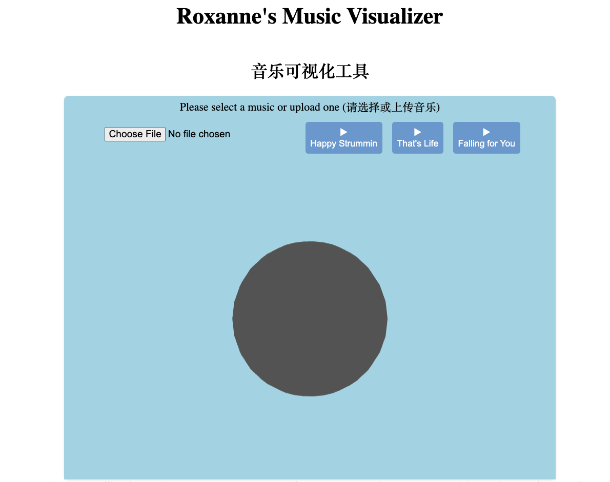

# Webpack project - 音乐可视化应用 Music Visualizer Web App

项目网页：https://roxanne1225.netlify.app/

## 介绍 Overview

这个音乐可视化器是一个网页应用程序，旨在为用户提供沉浸式的音频视觉体验。该项目采用 Webpack、TypeScript、React 和 Three.js 构建，并托管在 Netlify 上，通过迷人的视觉效果将音乐带入生活。

This Music Visualizer is a web application designed to offer users an immersive audio-visual experience. Built with TypeScript, React, Webpack, and Three.js, and hosted on Netlify, this project aims to bring music to life through captivating visualizations.

## 功能 - Features

- **动态音频分析 - Dynamic Audio Analysis**:
  对任何音频输入进行实时频率分析。Real-time frequency analysis for any audio input.
- **3D 可视化 - 3D Visualizations**:
  利用 Three.js 实现与音乐同步的 3D 图形。Leveraging Three.js for reactive 3D graphics synchronized with the music.
- **响应式设计 - Responsive Design**:
  打造在所有设备上无缝体验。 Crafted to provide a seamless experience across all devices.

## 本地开发指南 - Getting Started

To set up this project locally, follow these steps:

### Prerequisites

- Node.js
- NPM

### Installation

1. `git clone git@github.com:Roxanne1225/webpackProject.git`
2. `cd webpackProject`
3. `npm install`
4. (Optional) Build project: `npm run build`
5. Run project: `npm run start`
6. Open your browser and navigate to `http://localhost:3000`.

## 使用的技术 - Technologies Used

- **TypeScript**
- **React**
- **Webpack**
- **Three.js**
- **Netlify**

## 项目演示 - Live Demo

访问[项目网页](https://roxanne1225.netlify.app/)体验音乐可视化 app
Experience the Music Visualizer in action [here](https://roxanne1225.netlify.app/).

## 项目截图和视频演示 - Screenshots

